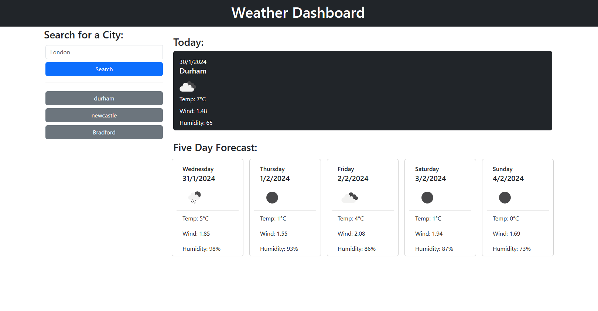

# Weathr-JS 🌦️
## Your Day, Your Way, Weather-Informed Every Day!

## Description
Weathr-JS is a dynamic weather web app that provides up-to-date forecasts for the current day and the next 5 days. Its intuitive interface allows you to plan your schedule ensuring you stay prepared for changing weather conditions

Created to address the challenges of planning amidst unpredictable weather, Weathr-JS empowers users to seamlessly integrate weather forecasts into their daily schedules. The app ensures that your plans align with the atmospheric conditions, allowing for more informed and adaptable planning.

Weathr-JS solves the problem of uncertainty in daily planning caused by unpredictable weather. It allows users to stay ahead of the forecast, providing hourly weather details to aid in decision-making. Weathr-JS ensures that your scheduling is not only efficient but also tailored to the ever-changing weather patterns.

Experience the convenience of weather-informed planning with Weathr-JS – because when it comes to your schedule, the forecast matters! 🌦️📅

Please see a full list of features [here](#Features)

## Table of Contents

- [Dev Requirements](#Dev-Requirements)
- [Dev Environment Setup](#Dev-Environment-Setup)
- [Enduser usage instructions](#End-user-usage-instructions)
- [Features](#Features)
- [How to contribute](#How-to-contribute)
- [technologies ](#technologies)
- [Screenshot](#Screenshot)
- [Credits](#credits)
- [License](#license)

## Dev Requirements
Git/GitBash, VS Code, and the source code, of course! 🛠️

## Dev Environment Setup
To get the development environment running:
1. Clone this repo
2. Open the repo folder in VS Code
3. Right-click on `index.html` and open it using the default browser.

- `index.html`: Contains all HTML code for the scheduler
- `assets/js/`: Contains all javaScript for the webapp
- `assets/images/`: Contains all images used in the webpage

## Enduser usage instructions
There is no special requirements for end users. Simply visit [here](https://rossne99.github.io/Weathr-JS/)

## Features
- **Allows you see the weather for today And the next 5 days**
- **Stores your search history**
- **Is Fully mobile responsive**
- **has a clean design**

## How to contribute
1. Fork this repository
2. Clone the repository
3. Create a branch for your bug fix or feature
4. Make necessary changes and commit those changes
5. Push changes to GitHub
6. Create a pull request to this repo to submit your changes for review

## Technologies
- **JavaScript**
- **HTML**
- **CSS**
- **Jquery**
- **DayJS**
- **OpenWeatherMap API**

## Screenshot

The following image shows the web application's appearance and functionality:

> **Note**: This webapp is fully mobile responsive.

## Credits 
- **Ross** - Source Code

---

## Licence

MIT License

Copyright (c) 2023 RossNE99

Permission is hereby granted, free of charge, to any person obtaining a copy
of this software and associated documentation files (the "Software"), to deal
in the Software without restriction, including without limitation the rights
to use, copy, modify, merge, publish, distribute, sublicense, and/or sell
copies of the Software, and to permit persons to whom the Software is
furnished to do so, subject to the following conditions:

The above copyright notice and this permission notice shall be included in all
copies or substantial portions of the Software.

THE SOFTWARE IS PROVIDED "AS IS", WITHOUT WARRANTY OF ANY KIND, EXPRESS OR
IMPLIED, INCLUDING BUT NOT LIMITED TO THE WARRANTIES OF MERCHANTABILITY,
FITNESS FOR A PARTICULAR PURPOSE AND NONINFRINGEMENT. IN NO EVENT SHALL THE
AUTHORS OR COPYRIGHT HOLDERS BE LIABLE FOR ANY CLAIM, DAMAGES OR OTHER
LIABILITY, WHETHER IN AN ACTION OF CONTRACT, TORT OR OTHERWISE, ARISING FROM,
OUT OF OR IN CONNECTION WITH THE SOFTWARE OR THE USE OR OTHER DEALINGS IN THE
SOFTWARE.